## 逻辑判断
考查严谨逻辑推演能力，难度最高
- 基础题型：翻译推理、真假推理、组合排列
- 重点题型：加强论证、削弱论证（占比最高）
- 小众题型：日常结论、原因解释
    💡核心：分清论点、论据，掌握论证削弱 / 加强常见方式。


---
# 第一章 逻辑判断 

【题型认知】 每道题给出一段陈述,这段陈述==被假设是正确==的,不容置疑的。要求你根据这段陈述,选择一个参考答案。 
注意:正确的参考答案应与所给的陈述相符合,不需要任何附加说明即可从陈述中直接推出。
**（一）形式推理**（**必然性推理**）
				：翻译推理、真假推理、集合推理、组合排列。
				考点1：假言命题 （条件关系命题）
				（一）. 充分条件假言命题
				（二）. 必要条件假言命题
**（二）论证逻辑**
**（三）分析推理**
# （一）形式推理
形式推理，只看命题结构，不关心内容真假，严格按照逻辑公式推导，结论确定。
包含四大题型：翻译推理、真假推理、集合推理、组合排列。
## 一、翻译推理（核心基础）

### 1. 翻译规则

1）**前推后（A→B）**
标志词：如果 A，那么 B；
> 例：如果下雨，地面湿 → 下雨→地面湿

2）**后推前（B→A）**
标志词：只有 A，才 B；
> 例：只有努力，才能上岸 → 上岸→努力

### 2. 核心推理规则
✅ **逆否等价：A→B ⇔ ¬B→¬A**
口诀：**肯前必肯后，否后必否前；否前、肯后推不出必然结论**

### 3. “且” 与 “或”
- A 且 B：两者同时成立，**全真才真，一假则假**
- A 或 B：至少一个成立，**一真则真，全假才假**
```
 德摩根定律（否定 且 / 或）
    ¬( A且B ) = ¬ A 或 ¬ B
    ¬( A或B ) = ¬ A 且 ¬ B
```

### 4. 要么 A，要么 B
二者只能有一个成立，不能同时成立、不能同时不成立。

## 二、真假推理

解题步骤：**找关系 → 定真假范围 → 看其余句子**
### 1. 矛盾关系（必有一真一假）
1. A 和 ¬A
2. A→B 和 A 且 ¬B
3. 所有是 ↔ 有的不是
4. 所有不是 ↔ 有的是
### 2. 反对关系
1. 所有是 & 所有不是 → **至少一假**
2. 有的是 & 有的不是 → **至少一真**

## 三、集合推理（“所有 / 有的”）

### 4 组基础翻译
1. 所有 A 都是 B：\(A→B\)
2. 所有 A 都不是 B：\(A→¬B\)
3. 有的 A 是 B：**有的 A→B**（不能逆否！）
4. 有的 A 不是 B：有的 A→¬B
### 核心换位公式
1. 有的 A 是 B ↔ 有的 B 是 A（可互换）
2. 所有 A 都是 B → 某个A是B→ 有的 A 是 B （有的 B 是 A）
3. 所有 A 都不是 B ↔ 所有 B 都不是 A（可互换）
## 四、组合排列（分析推理）

特征：题干给出多组对象、多组条件，进行匹配排序
1. **选项信息充分**：优先使用【代入法、排除法】
2. **选项信息不充分**：优先【最大信息法】（从出现次数最多条件入手）
3. 辅助方法：列表、画图；难题可假设验证
---
# 考点1：假言命题 （条件关系命题）
假言命题，研究**两个事物之间的条件关系**。
## 一、充分条件假言命题
### （一）定义
<font color="#ff0000">如果 A 成立，B 就一定成立。 </font> **有 A 就一定有 B**。👉 称：**A 是 B 的充分条件**
通俗理解：**有它就行，没它不一定不行**。
逻辑表达式：A→B
			A：充分条件
			B：必要结果
翻译口诀：**充分条件，前推后**

```
课堂例子 
“孩子哭，就喂奶”
	A：孩子哭
	B：喂奶
翻译：孩子哭 → 喂奶
```

**<font color="#ff0000">核心口诀：充分条件，前推后（前是后的充分）</font>**
### （二）充分条件全部标志词（看到直接前推后 (A→B）

1. 如果 A，那么 B

2. 如果 A，就 B
3. 只要 A，就 B
4. A 就 B
5. A 则 B
6. 若 A，则 B
7. 倘若 A，则 B
8. 一旦 A，就 B
9. 假如 A，就 B（**则 = 就**）

10. A 必须 B
11. A 离不开 B
12. 为了 A，要 B

13. 所有 A 都 B
14. 凡是 A 都 B
15.  但凡 A，都 B

16. A 一定 B / A 必然 B
17. 想要 A，必须 B
18. A 是 B 的充分条件

   <font color="#ff0000"> 翻译：A→B</font>

**A，否则 B**。不属于常规充分条件标志词，独立公式：<font color="#ff0000">(¬A→ B)</font>

> 做题技巧：出现以上词汇，直接锁定充分条件，箭头从前指向后。

### （三）、核心推理规则
原命题：A→B

1. ✅ **肯前必肯后**：<font color="#ff0000">A 成立 → B 一定成立</font>
    例：考上→听课；考上了，说明一定听了课。
2. ✅ **否后必否前（逆否等价）**： <font color="#ff0000">¬B→ ¬A </font>
    逆否命题和原命题**完全等价，同真同假**，是考试最高频考点。
    例：考上→听课；没听课，一定没考上。
3. ❌ **否前 ，肯后无必然结论**
    没考上，无法判断有没有听课。
    听了课，不一定能考上。
> 总结：<font color="#ff0000">只有「肯前」和「否后」能推出确定结论</font>；
 		肯后、否前只能推出可能性结论。

### （四）矛盾命题（真假推理必考）
命题：       A → B
矛盾命题：A Λ ¬В
释义：A 这件事发生了，但是 B 这件事没有发生。

⚠️易错提醒：
\(A→B\) 的矛盾**不是 \(A→¬ B\)**！
```
举例：如果上岸，就要听课。
矛盾：上岸了，但是没有听课。
```

### （五）拓展知识点

#### 1. 同义转换
<font color="#ff0000">则 = 就</font>
 “A 则 B” 等价于 “A 就 B”
 统一前推后：A→B
示例：穷则独善其身 = 如果穷，就独善其身。

#### 2. A，否则 B（高频易混句式）
含义：<font color="#ff0000">否则 = 不然就</font>
固定翻译：<font color="#ff0000">(¬A→ B)</font>
例子：按时完成，否则罚款
翻译：¬ 按时完成 → 罚款

```
（六）课堂练习题逐句标准翻译

1. 如果坚持一下，那么梦想会实现
    坚 → 梦
2. 如果没有阳光的照耀和雨露的滋润，那么花儿不会开得鲜艳
    ¬ 阳 ∧ ¬ 雨 → ¬ 艳
3. 只要付出努力，就会有收获
    付 → 获
4. 穷则独善其身
    穷 → 独
5. 建设现代化经济体系，必须坚持质量第一、效益优先
    体系 → 质，效
6. 为了实现梦想，要坚持到底
    实现梦想 → 坚持到底
7. 所有诋毁袁隆平院士的人都应该受到惩罚
    诋毁 → 惩罚
8. 凡是毛主席作出的决策，我们都坚决维护
    决策 → 维护
9. 不到长城非好汉
    翻译形式：¬ 到长城 → ¬ 好汉
    逆否等价：好汉 → 到长城
```

## 二、必要条件假言命题
### （一）定义
如果 A 是 B 的**必要条件**：**没有 A，就没有 B**。
简言之：**无 A 必无 B**。
A 是B 的必要条件、不可或缺的条件。

逻辑表达式： <font color="#ff0000">B→A </font>
> A = 必要条件；B = 充分条件

### （二）核心翻译口诀

必要条件，**后推前**
		A →  B
		A 是B 的充分条件。前充分。
		B 是A 的必要条件。后必要。
### （三）全部逻辑关联词（统一翻译：(B→A）

1. 只有 A，才 B
2. A，才 B
3. **A 是 B 的前提 / 基础**
4. **A 是 B 的必要条件 / 必备条件 / 先决条件 / 必然要求/ 必不可少的条件**

5. B 以 A 为前提

6. 没有 A，就没有 B
    逻辑式：¬A→ ¬B，逆否等价：B→ A
7. 不 A，不 B
    例：不努力，不能上岸 = 上岸→努力

8. 除非 A，才 B　　   (B→ A)
9. 除非 A，否则不 B　(B→ A)

10. A 是 B 不可或缺的保障
### ⚠️重点区分【除非三组句型】
1. 除非 A，<font color="#ff0000">才</font> B　　(B→A）（必要条件）
2. 除非 A，<font color="#ff0000">否则</font>不 B　(B→A）（必要条件）
3. 除非 A，否则 B　(¬A→ B)
    逆否等价：(¬B→ A)

### （四）推理规则
原式：(B→A）
✅有效推理（一定成立）

✅ **肯前必肯后**
✅ **否后必否前
❌ **否前 ，肯后无必然结论**


### （五）连锁推理（考试高频）

多个假言命题首尾一致，可以串联成一条逻辑链
句式：(X→Y，Y→Z)
合并：X→ Y→Z

做题技巧：
选项匹配正向链条 或者 完整逆否链条 → 正确

### （六）配套对照：充分条件
充分条件：只要 A，就 B，**前推后**
<font color="#ff0000">A→B</font>
① A 是 B 的充分 → **前充分**
② B 是 A 的必要 → **后必要**

💡核心口诀：**前充分，后必要；箭头后面永远是必要条件**
<font color="#ff0000">有效推理：肯前必肯后、否后必否前</font>
<font color="#ff0000">无效推理：否前、肯后</font>

```
#【练习】画箭头 完整解析
翻译规则回顾：
✅必要条件（只有… 才…、A 是 B 前提、没有 A 就没有 B、除非 A 才 B）：后推前 (B→ A)
1. 只有社会主义才能救中国，只有改革开放才能发展中国
    句式：只有 A，才 B（后推前）
    救中国 → 社会主义
    发展中国 → 改革开放

2. 没有共产党，就没有新中国
    句式：没有 A，就没有 B（后推前）
    新中国 → 共产党

3. 稳定是发展的前提
    句式：A 是 B 的前提（后推前）
    发展 → 稳定
    
4. 除非八抬大轿，我才嫁给你
    句式：除非 A，才 B（后推前）
    嫁给你 → 八抬大轿

5. 除非努力，否则失败
    句式：除非 A，否则 B
    公式：¬努力 → 失败，等价 ¬失败 → 努力（不失败→努力）
```

## 三、推理规则（翻译完成后使用）

### 规则 1：逆否等值
原式：A → B
等价命题：¬B → ¬A
> 原命题 和 逆否命题 **同真同假，永远等价**
#### 核心推论（必背）
口诀：**肯前必肯后，否后必否前；否前、肯后无必然结论**

### 规则 2：连锁传递规则（递推，长链条题型）
已知： A→B            B→ C 
可直接拼接：A→C
再取逆否：¬C   →    ¬A

### 规则 3：二难推理（两种标准模型，直接得出确定结论）
#### 模型①：前件互补，后件相同
<font color="#ff0000">   A→ B             </font>
<font color="#ff0000">¬ A→B </font>
结论：**B 必然为真**
解读：无论 A 成立还是不成立，最终结果都是 B，因此 B 一定发生。
例子：如果下雨堵车，如果不下雨也堵车 → 一定会堵车
#### 模型②：前件相同，后件矛盾
<font color="#ff0000">A→   B  </font>
<font color="#ff0000">A→¬B </font>
结论：**A必然为假
解读：假设 A 成立，会同时推出 B 和¬B，自相矛盾；
       因此假设不成立，A 一定不成立。
例子：如果报考就能上岸；如果报考就不能上岸 → 一定不要报考
> 识别技巧：看到两组箭头，优先观察前件、后件是否互补 / 矛盾，匹配二难直接秒答案。

```
## 题干：如果某人是杀人犯，那么案发时他在现场。
据此我们可以推知（）
A. 张三案发时在现场，所以张三是杀人犯
B. 李四不是杀人犯，所以李四案发时不在现场
C. 王五案发时不在现场，所以王五不是杀人犯
D. 徐六不在案发现场，所以徐六是杀人犯

翻译：杀人犯 → 在现场（杀 → 在）
逆否等价：不在现场 → 不是杀人犯

## 笔记要点
1. 肯前、否后：一定可以推出
2. 否前、肯后：真假不确定
3. 一定为假：二难推理D
```

---
## 四、矛盾命题

### （一）基础定义
假言命题通用形式：          (A →    B)
**矛盾命题**：A不能推出B      (A 且¬ B)
文字：A 发生了，**但是** B 没有发生<font color="#ff0000">（肯前且否后）</font>

### 核心重中之重

❌ 误区：(A → B)  的矛盾不是 (A →¬ B)
✅ 真相：推出关系的矛盾**是  且命题**。
想要推翻 “有 A 一定有 B”，只需要举出一例：A 出现，B 没出现。

### <font color="#ff0000">（二）配套拓展：(A  → B) 真假判定</font>
**(A  →  B)** 
1. **原命题必假**
    出现(A 且¬ B)（肯前且否后）→ 矛盾，一定为假。
    题型特征：某人说 “A→B”，另一人 “不同意”，直接选(A 且¬ B)。
    
2. **原命题必真**
    两种情况：
    ① 肯前（A 成立）；② 否后（¬ B成立）
    
3. **真假无法确定**
    两种情况：
    ① 否前（¬ A）；② 肯后（B）
    
> 否前、肯后推不出必然结论！
```
举例：下雨→地湿
	下雨（肯前）→命题成立
	地面没湿（否后）→命题成立
	下雨且地面不湿（肯前否后）→命题为假
	没下雨（否前）、地面湿（肯后）→无法判断原命题真假

执法人员：不在限期自行拆除 → 依法强拆（¬ 自拆 → 强拆）
居民：我不同意。
找：¬ 自拆 且¬ 强拆
翻译：不自行拆除，并且不强拆。
```

### （三）做题固定步骤

1. 识别关联词，正确翻译为(A  → B)；
2. 看到 “不同意、此话为假”，直接写矛盾：(A 且¬ B)；
3. 把逻辑式子翻译成自然语言，匹配选项；
4. 警惕陷阱选项：形如(A →¬ B)的推出式一律不选。

---
# 考点2：联言命题（A ∧ B）
核心特征是**缺一不可，必须同时成立**。
## （一）定义与辨识

### 1. 定义
- **数学表达**：设命题 A 和命题 B，联言命题记为 **A ∧ B**。
- **逻辑实质**：**同时成立**。
### 2. 辨识（如何找“且”）
- **第一类：并列关系（最直白）**
    - **关键词**：且、与、和、及、既……又……、一边……一边……、同时。
- **第二类：转折关系（逻辑上的“且”）**
    - **关键词**：但、却、然而、虽然……但是……、尽管……可是……。
    - _易错点_：转折词在语感上表示相反，但在**逻辑命题**中，它依然表示两个情况**同时发生**。
- **第三类：递进关系（强调后项）**
    - **关键词**：而且、甚至、更、还、况且、不但……而且……。
- **第四类：语意隐含（考语感）**
    - **关键词**：**高富帅**。
```
【练习】辨析联言 
1. 高端大气上档次（并列属性）
    逻辑翻译：高端 ∧ 大气 ∧ 上档次  

2. 你看到我的成功，但是没看到我的付出
类型：转折关系（用“但是”连接） 
- 逻辑翻译：看到我的成功 ∧没看到我的付出

2. 我和我的小伙伴都惊呆了

类型：并列关系（用“和”连接）
    
逻辑翻译：我惊呆了 ∧ 我的小伙伴惊呆了

    

4. 虽然学习了，但没考上
类型：转折关系（“虽然...但是...”）
    
逻辑翻译：学习了 ∧ 没考上

    

5. 我对你又爱又恨
类型：并列关系（“又...又...”）
    
逻辑翻译：对你爱 ∧ 对你恨

- **示例**：“他**爱家更爱国**。”
    - **公式化**：爱家 **∧** 爱国。
      - **示例**：“她**虽然**生病了，**但是**坚持上班。”
    - **公式化**：生病 **∧** 坚持上班。

```
## （二）真假判定逻辑（核心计算法）

一旦把句子翻译成了 `A ∧ B`，我们就要判断它的真假。**记住两条铁律（口诀）即可。**

### 1. 铁律一：【全真则真】

- 含义：只有当 A 为**真**，且 B 也为**真**时，整个 `A且B` 才是**真**的。
    
- 比喻：就像串联电路，必须两个开关都闭合，灯泡才会亮。
    

### 2. 铁律二：【有假则假】

- 含义：只要 A 和 B 中，**有一个**（甚至两个都为）**假**，那么整个 `A且B` 就一定是**假**的。
    
- 推论：即使 A 真、B 假，或者 A 假、B 真，结果都是假。
    

### 📊 3. 真值表（必背）

为了方便记忆，我们可以把它的**真假组合**列成表格（假设 A、B 两个命题）：

|命题 A|命题 B|**A 且 B (A ∧ B)**|**结论总结**|
|---|---|---|---|
|**真**|**真**|**真**|**全真则真**|
|**真**|**假**|**假**|**有假则假**|
|**假**|**真**|**假**|**有假则假**|
|**假**|**假**|**假**|**有假则假**|

**💡 做题技巧**：在做真假判断题时，只要看到 `A且B` 为假，不要立刻断定 A 和 B 都是假的，**只需知道“至少有一个是假的”**。

---

## （三）联言命题的否定（重中之重！德摩根定律）

在逻辑考试中，最常考的不是联言命题本身，而是**“并非（A且B）”**等价于什么。这时候需要用到著名的**德摩根定律**。

### 1. 核心公式（必须死记硬背）

> **`¬(A ∧ B)` 等价于 `¬A ∨ ¬B`**  
> _(读作：并非“A且B” 等于 “非A” 或 “非B”)_

**记忆口诀**：**“且变或，否定往下走”**（或者说：打开括号，且变或，每个词前加非）。

### 2. 深度拆解：为什么是这样？（真实含义）

当 `(A且B)` 为**假**时，说明 A 和 B **没有同时成立**。那现实中到底发生了什么？  
它必然对应以下**三种情况之一**（这就是刚才说的“至少有一个是假的”的展开）：

1. **A是假的，B是真的**（对应：非A且B）
    
2. **A是真的，B是假的**（对应：A且非B）
    
3. **A是假的，B也是假的**（对应：非A且非B）
    

**结论**：只要满足 1、2、3 中的任意一种，`A且B` 就是假的。在逻辑符号上把这三个可能性合并写，就变成了 **`非A 或 非B`**。

---

## （四）真题应用与易错陷阱（实战演练）

**场景一：翻译并推理**

- **题干**：“小明既高且富且帅” 为假。
    
- **提问**：你能得出什么确定结论？
    
- **分析**：`高 ∧ 富 ∧ 帅` 为假。根据“有假则假”，说明高、富、帅中**至少有一个（或两个、或三个）是假的**。
    
- **⚠️ 陷阱**：你不能断定“高是假的”或者“富是假的”，因为未给出其他条件时，我们只知道“至少一个假”。
    

**场景二：负命题的转换**

- **题干**：“并非（小明今天吃苹果且吃香蕉）”。
    
- **提问**：这句话等价于什么？
    
- **分析**：使用德摩根定律。括号内的“且”变成“或”，同时给“吃苹果”和“吃香蕉”加上“不”。
    
- **答案**：**小明今天不吃苹果 或 不吃香蕉**。（包含三种情况：只吃苹果、只吃香蕉、两者都不吃）。
    

**场景三：日常语言的辨析**

- **题干**：“他在**失恋**的打击下，不但没有消沉，**反而**更加努力了。”（找出其中的联言命题）
    
- **分析**：虽然没有明确的“且”字，但“不但...反而...”是递进关系，意味着“没有消沉”和“更加努力”同时成立。
    
- **公式化**：非消沉 **∧** 更努力。
    

### 📝 最终总结记忆卡片

1. **找联言**：看到**且、和、但、却、而且**，或者**语意并列**，直接写 `∧`。
    
2. **判真假**：**全真才真，一假就假**（串联电路原则）。
    
3. **求否定**：遇到“并非(A且B)”，**打开括号，且变或，前加非**（即 `非A 或 非B`）。
    

如果您感觉这个框架已经很清晰，或者还需要我补充**联言命题与选言命题（A或B）的混合推理**，或者**提供几道具体的练习题**，您可以告诉我，我们继续深入。

![[图片/Pasted image 20260815115711.png]]

![[图片/Pasted image 20260815120101.png]]

![[图片/Pasted image 20260815120320.png]]

![[图片/Pasted image 20260815120424.png]]
![[图片/Pasted image 20260815124256.png]]

---
![[图片/Pasted image 20260815124614.png]]
![[图片/Pasted image 20260815124759.png]]

![[图片/Pasted image 20260815124833.png]]

![[图片/Pasted image 20260815124913.png]]
![[图片/Pasted image 20260815133449.png]]
![[图片/Pasted image 20260815134121.png]]

---

![[图片/Pasted image 20260815134328.png]]

![[图片/Pasted image 20260815134530.png]]

![[图片/Pasted image 20260815134737.png]]

![[图片/Pasted image 20260815135537.png]]

![[图片/Pasted image 20260815135923.png]]

---

![[图片/Pasted image 20260815140346.png]]

![[图片/Pasted image 20260815140457.png]]

![[图片/Pasted image 20260815140520.png]]
![[图片/Pasted image 20260815140700.png]]
![[图片/Pasted image 20260815140912.png]]
![[图片/Pasted image 20260815152124.png]]
![[图片/Pasted image 20260815152712.png]]
![[图片/Pasted image 20260815154545.png]]

![[图片/Pasted image 20260815154742.png]]
![[图片/Pasted image 20260815155125.png]]
![[图片/Pasted image 20260815155602.png]]

![[图片/Pasted image 20260815160051.png]]

反对关系

---


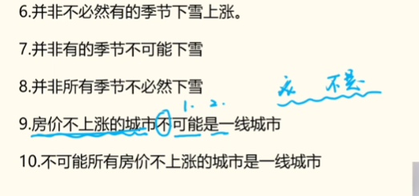


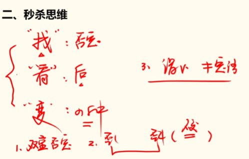


## （二）分析推理


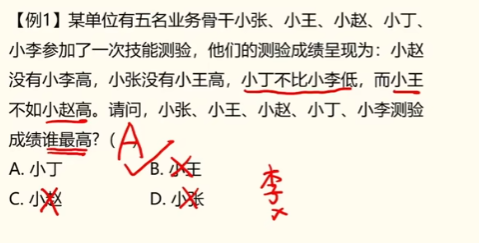


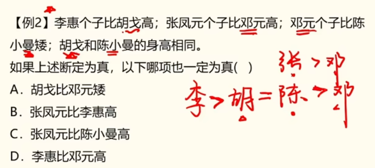


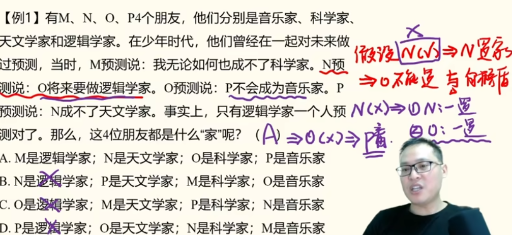


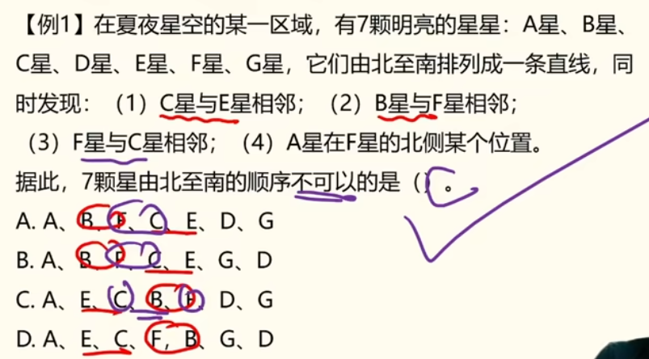
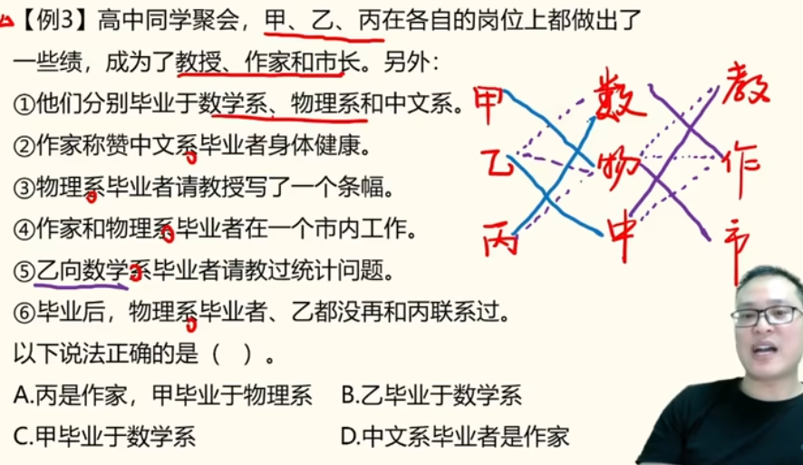


## （三）论证逻辑


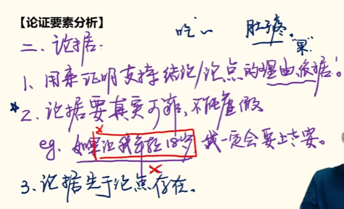


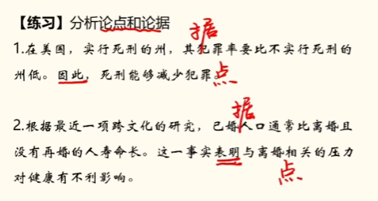


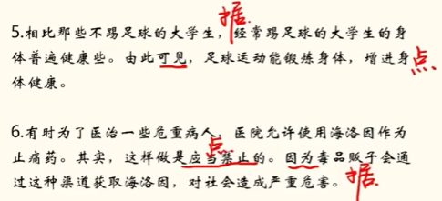


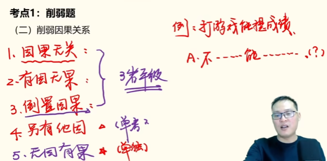


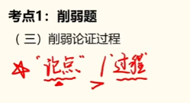


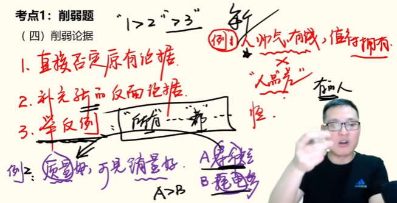


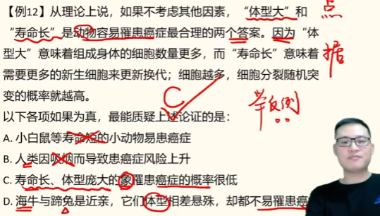
