# 判断推理四大考点体系

这是公务员行测**判断推理**模块完整四大题型框架，也是公考行测核心得分模块，国考一般每种题型各 10 题，合计 40 道。
## 1. 图形推理
考查图形规律识别能力
- **平面图形**：位置规律、样式规律、属性规律（对称、曲直、开闭）、数量规律（点线面素角）、特殊规律
- **空间图形**：六面体空间重构、三视图、截面图、立体拼合
    💡难点：图形特征识别，需要多刷题建立图形敏感度。
## 2. 定义判断
考查文字信息筛选、概念理解能力
- 做题思路：圈画题干**主体、客体、条件、结果、限定词**，逐一比对选项
- 分为单定义、多定义；无需专业知识，严格遵循题干定义，不要带入常识主观臆断。
## 3. 类比推理
考查词语间逻辑关系辨析
三大核心关系：
- 外延关系：全同、并列（矛盾 / 反对）、包容（种属 / 组成）、交叉
- 内涵关系：功能、因果、时间顺序、原材料
- 语义关系：近义、反义、比喻象征
    ⚠️近年常结合常识考查，注意二级辨析（感情色彩、主次功能、必然 / 或然）。
## 4. 逻辑判断
考查严谨逻辑推演能力，难度最高
- 基础题型：翻译推理、真假推理、组合排列
- 重点题型：加强论证、削弱论证（占比最高）
- 小众题型：日常结论、原因解释
    💡核心：分清论点、论据，掌握论证削弱 / 加强常见方式。


---
# 第一章 逻辑判断 

【题型认知】 每道题给出一段陈述,这段陈述==被假设是正确==的,不容置疑的。要求你根据这段陈述,选择一个参考答案。 
注意:正确的参考答案应与所给的陈述相符合,不需要任何附加说明即可从陈述中直接推出。
**（一）形式推理**
**（二）论证逻辑**
**（三）分析推理**
# （一）形式推理
形式推理，又称**必然性推理**，只看命题结构，不关心内容真假，严格按照逻辑公式推导，结论确定。
包含四大题型：翻译推理、真假推理、集合推理、组合排列。
## 一、翻译推理（核心基础）

### 1. 翻译规则

1）**前推后（A→B）**
标志词：如果 A，那么 B；
> 例：如果下雨，地面湿 → 下雨→地面湿

2）**后推前（B→A）**
标志词：只有 A，才 B；
> 例：只有努力，才能上岸 → 上岸→努力

### 2. 核心推理规则
✅ **逆否等价：A→B ⇔ ¬B→¬A**
口诀：**肯前必肯后，否后必否前；否前、肯后推不出必然结论**

### 3. “且” 与 “或”
- A 且 B：两者同时成立，**全真才真，一假则假**
- A 或 B：至少一个成立，**一真则真，全假才假**
- 德摩根定律（否定且 / 或）
    (¬(A且B) = ¬ A 或 ¬ B)
    (¬(A或B) = ¬A 且 ¬B)

### 4. 要么 A，要么 B
二者只能有一个成立，不能同时成立、不能同时不成立。
## 二、集合推理（“所有 / 有的”）

### 4 组基础翻译
1. 所有 A 都是 B：\(A→B\)
2. 所有 A 都不是 B：\(A→¬B\)
3. 有的 A 是 B：**有的 A→B**（不能逆否！）
4. 有的 A 不是 B：有的 A→¬B

### 核心换位公式
1. 有的 A 是 B ↔ 有的 B 是 A（可互换）
2. 所有 A 都是 B → 有的 B 是 A（单向）
3. 所有 A 都不是 B ↔ 所有 B 都不是 A（可互换）
⚠️重点：**“有的” 不能逆否；有的 A 是 B，推不出有的 A 不是 B**
## 三、真假推理

解题步骤：**找关系 → 定真假范围 → 看其余句子**
### 1. 矛盾关系（必有一真一假）
1. A 和 ¬A
2. A→B 和 A 且 ¬B
3. 所有是 ↔ 有的不是
4. 所有不是 ↔ 有的是

### 2. 反对关系
1. 所有是 & 所有不是 → **至少一假**
2. 有的是 & 有的不是 → **至少一真**
## 四、组合排列（分析推理）

特征：题干给出多组对象、多组条件，进行匹配排序
1. **选项信息充分**：优先使用【代入法、排除法】
2. **选项信息不充分**：优先【最大信息法】（从出现次数最多条件入手）
3. 辅助方法：列表、画图；难题可假设验证
---
# 考点1：假言命题 （条件关系命题）
假言命题，又叫条件命题，研究**两个事物之间的条件关系**。
### （一）. 充分条件假言命题
## 1. 定义
<font color="#ff0000">如果 A 成立，B 就一定成立。 </font> **有 A 就一定有 B**。只要 A 发生，B 必然发生；但没有 A，B 依然有可能发生。👉 称：**A 是 B 的充分条件**
通俗理解：**有它就行，没它不一定不行**。
逻辑表达式：A→B
			A：充分条件
			B：必要结果
翻译口诀：**充分条件，前推后**（句子前半部分→后半部分）
### 课堂例子 1
> “孩子哭，就喂奶”
> A：孩子哭
> B：喂奶
> 翻译：孩子哭 → 喂奶

## 2. 核心口诀：充分条件，前推后（前是后的充分）
含义：充分条件出现在句子前面，结果放在句子后面，直接写成「前→后」

## 二、充分条件全部标志词（看到直接前推后 (A→B）

1. 如果 A，那么 B
2. 如果 A，就 B
3. 只要 A，就 B
4. A 就 B
5. A 则 B（**则 = 就**）
6. A 必须 B
7. A 离不开 B
8. 为了 A，要 B
9. 所有 A 都 B
10. 凡是 A 都 B
11. 若 A，则 B
12. 倘若 A，则 B
13. 一旦 A，就 B
14. 假如 A，就 B
15. 但凡 A，都 B
16. A 一定 B / A 必然 B
17. 想要 A，必须 B
18. A 是 B 的充分条件
    
    翻译：A→B

补充区分【不属于上面清单，单独记忆！】
**A，否则 B**。不属于常规充分条件标志词，独立公式：<font color="#ff0000">(¬A→ B)</font>
> 做题技巧：出现以上词汇，直接锁定充分条件，箭头从前指向后。

## 三、核心推理规则

原命题：(A→B）

1. ✅ **肯前必肯后**：<font color="#ff0000">A 成立 → B 一定成立</font>
    例：考上→听课；考上了，说明一定听了课。
2. ✅ **否后必否前（逆否等价）**： <font color="#ff0000">¬B→ ¬A </font>
    逆否命题和原命题**完全等价，同真同假**，是考试最高频考点。
    例：考上→听课；没听课，一定没考上。
3. ❌ **否前 ，肯后无必然结论**
    没考上，无法判断有没有听课。
    听了课，不一定能考上。
> 总结：<font color="#ff0000">只有「肯前」和「否后」能推出确定结论</font>；肯后、否前只能推出可能性结论。

## 四、矛盾命题（真假推理必考）
命题：A → B
矛盾命题：A Λ ¬В
文字释义：A 这件事发生了，但是 B 这件事没有发生。

⚠️易错提醒：
\(A→B\) 的矛盾**不是 \(A→¬ B\)**！
<font color="#ff0000">举例：如果上岸，就要听课。</font>
<font color="#ff0000">矛盾：上岸了，但是没有听课。</font>

## 五、课堂练习题逐句标准翻译

1. 如果坚持一下，那么梦想会实现
    坚 → 梦
2. 如果没有阳光的照耀和雨露的滋润，那么花儿不会开得鲜艳
    ¬ 阳 ∧ ¬ 雨 → ¬ 艳
3. 只要付出努力，就会有收获
    付 → 获
4. 穷则独善其身
    穷 → 独
5. 建设现代化经济体系，必须坚持质量第一、效益优先
    体系 → 质，效
6. 为了实现梦想，要坚持到底
    实现梦想 → 坚持到底
7. 所有诋毁袁隆平院士的人都应该受到惩罚
    诋毁 → 惩罚
8. 凡是毛主席作出的决策，我们都坚决维护
    决策 → 维护
9. <font color="#ff0000">不到长城非好汉</font>
    翻译形式：¬ 到长城 → ¬ 好汉
    逆否等价：好汉 → 到长城
    ⚠️注意：这句话可以写成充分条件形式，但属于典型必要条件句式，学习完必要条件后重点区分，避免混淆。

## 六、拓展知识点

### 1. 同义转换
<font color="#ff0000">则 = 就</font>
 “A 则 B” 等价于 “A 就 B”，统一前推后：(A→B)
示例：穷则独善其身 = 如果穷，就独善其身。

### 2. A，否则 B（高频易混句式）
含义：<font color="#ff0000">否则 = 不然就</font>
固定翻译公式：<font color="#ff0000">(¬A→ B)</font>
例子：按时完成，否则罚款
翻译：¬ 按时完成 → 罚款


### （二）. 必要条件假言命题
## 一、定义

如果 A 是 B 的**必要条件**：**没有 A，一定没有 B**。
简言之：**无 A 必无 B，有 A 未必有 B**。
A 是达成 B 必不可少、不可或缺的条件，但仅有 A 不足以保证 B 发生。

逻辑表达式： <font color="#ff0000">B→A </font>
解读：若 B 成立，则 A 一定成立。
> A = 必要条件；B = 充分条件
![[图片/Pasted image 20260808101651.png]]
## 二、核心翻译口诀

必要条件，**后推前**
补充备注：【前是后充分；箭头后是必要】
## 三、全部逻辑关联词（统一翻译：(B→A）

1. 只有 A，才 B
2. A，才 B
3. **A 是 B 的前提 / 基础**
4. **A 是 B 的必要条件 / 必备条件 / 先决条件 / 必然要求/ 必不可少的条件**
5. B 以 A 为前提
6. 想要实现 B，必须 A
7. B 必须 A

> ⚠️区分：
> 实现 B，必须 A → 必要条件：(B→ A)
> 只要 A，就能 B → 充分条件：(A→B)

8. 没有 A，就没有 B
    逻辑式：¬A→ ¬B，逆否等价：B→ A
9. 不 A，不 B
    例：不努力，不能上岸 = 上岸→努力

10. 除非 A，才 B　　(B→ A)
11. 除非 A，否则不 B　(B→ A)

> ❗不属于必要条件（不要混进来）

12. 除非 A，否则 B　（¬A→ B）     逆否：（¬B→ A）
13. B 离不开 A
14. B 取决于 A
15. A 是 B 不可或缺的保障
### ⚠️重点区分【除非三组句型】
1. 除非 A，<font color="#ff0000">才</font> B　　(B→A）（必要条件）
2. 除非 A，<font color="#ff0000">否则</font>不 B　(B→A）（必要条件）
3. 除非 A，否则 B　(¬A→ B)
    逆否等价：(¬B→ A)

## 四、推理规则
原式：(B→A）
✅有效推理（一定成立）

✅ **肯前必肯后**
✅ **否后必否前
❌ **否前 ，肯后无必然结论**
## 五、举例理解

例句：只有有水（A），才能种水稻（B）

翻译：种水稻 → 有水（B→ A）
1. 肯后：能种水稻 → 一定有水 ✅
2. 否前：没有水 → 不能种水稻 ✅
3. 肯前：有水，不一定能种水稻（还需要土壤、阳光）❌
4. 否后：不能种水稻，不知道是不是缺水 ❌

## 六、连锁推理（考试高频）

多个假言命题首尾一致，可以串联成一条逻辑链
句式：(X→Y，Y→Z)
合并：X→ Y→Z

做题技巧：
选项匹配正向链条 或者 完整逆否链条 → 正确

## 七、配套对照：充分条件（方便区分记忆）

充分条件：只要 A，就 B，**前推后**
<font color="#ff0000">A→B</font>
① A 是 B 的充分 → **前充分**
② B 是 A 的必要 → **后必要**

💡核心口诀：**前充分，后必要；箭头后面永远是必要条件**
<font color="#ff0000">有效推理：肯前必肯后、否后必否前</font>
<font color="#ff0000">无效推理：否前、肯后</font>

```
#【练习】画箭头 完整解析
翻译规则回顾：
✅必要条件（只有… 才…、A 是 B 前提、没有 A 就没有 B、除非 A 才 B）：后推前 (B→ A)
1. 只有社会主义才能救中国，只有改革开放才能发展中国
    句式：只有 A，才 B（后推前）
    救中国 → 社会主义
    发展中国 → 改革开放

2. 没有共产党，就没有新中国
    句式：没有 A，就没有 B（后推前）
    新中国 → 共产党

3. 稳定是发展的前提
    句式：A 是 B 的前提（后推前）
    发展 → 稳定
    
4. 除非八抬大轿，我才嫁给你
    句式：除非 A，才 B（后推前）
    嫁给你 → 八抬大轿

5. 除非努力，否则失败
    句式：除非 A，否则 B
    公式：¬努力 → 失败，等价 ¬失败 → 努力（不失败→努力）
```

## 第二部分：推理规则（翻译完成后使用）

### 规则 1：逆否等值

原式：A → B
等价命题：¬B → ¬A
> 原命题 和 逆否命题 **同真同假，永远等价**

#### 核心推论（必背）

口诀：**肯前必肯后，否后必否前；否前、肯后无必然结论**

> 举例：无风→不起浪 = 起浪→有风
> 没有风，不确定有没有浪（否前无效）；有浪，一定有风（否后必否前）

### 规则 2：连锁传递规则（递推，长链条题型）
已知： A→B            B→ C 
可直接拼接：A→C
再取逆否：¬C   →    ¬A

### 规则 3：二难推理（两种标准模型，直接得出确定结论）
#### 模型①：前件互补，后件相同
<font color="#ff0000">   A→ B             </font>
<font color="#ff0000">¬ A→B </font>
结论：**B 必然为真**
解读：无论 A 成立还是不成立，最终结果都是 B，因此 B 一定发生。
例子：如果下雨堵车，如果不下雨也堵车 → 一定会堵车
#### 模型②：前件相同，后件矛盾
<font color="#ff0000">A→   B  </font>
<font color="#ff0000">A→¬B </font>
结论：**A必然为假
解读：假设 A 成立，会同时推出 B 和¬B，自相矛盾；
       因此假设不成立，A 一定不成立。
例子：如果报考就能上岸；如果报考就不能上岸 → 一定不要报考
> 识别技巧：看到两组箭头，优先观察前件、后件是否互补 / 矛盾，匹配二难直接秒答案。

```
## 题干：如果某人是杀人犯，那么案发时他在现场。
据此我们可以推知（）
A. 张三案发时在现场，所以张三是杀人犯
B. 李四不是杀人犯，所以李四案发时不在现场
C. 王五案发时不在现场，所以王五不是杀人犯
D. 徐六不在案发现场，所以徐六是杀人犯

翻译：杀人犯 → 在现场（杀 → 在）
逆否等价：不在现场 → 不是杀人犯

## 笔记要点
1. 肯前、否后：一定可以推出
2. 否前、肯后：真假不确定
3. 一定为假：二难推理D
   
```

---
# （四）矛盾命题

## 一、基础定义

假言命题通用形式：(A → B)

翻译：如果 A，那么 B；只要 A 就 B；A 是 B 的充分条件。

含义：**有 A 就一定有 B**。

**矛盾命题**：A不能推出B (A 且¬ B)

文字：A 发生了，**但是** B 没有发生<font color="#ff0000">（肯前且否后）</font>
### 核心重中之重

❌ 误区：(A → B)  的矛盾不是 (A →¬ B)

✅ 真相：推出关系的矛盾**是  且命题**。

想要推翻 “有 A 一定有 B”，只需要举出一例：A 出现，B 没出现。


## <font color="#ff0000">二、配套拓展：(A  → B) 真假判定</font>

1. **原命题必假**
    出现(A 且¬ B)（肯前且否后）→ 矛盾，一定为假。
    题型特征：某人说 “A→B”，另一人 “不同意”，直接选(A 且¬ B)。
    
2. **原命题必真**
    两种情况：
    ① 肯前（A 成立）；② 否后（¬ B成立）
    
3. **真假无法确定**
    两种情况：
    ① 否前（¬ A）；② 肯后（B）
    
> 否前、肯后推不出必然结论！

举例：下雨→地湿

- 下雨（肯前）→命题成立
- 地面没湿（否后）→命题成立

- 下雨且地面不湿（肯前否后）→命题为假

- 没下雨（否前）、地面湿（肯后）→无法判断原命题真假

## 三、经典真题模型

执法人员：不在限期自行拆除 → 依法强拆

\(\neg\)自拆 \(\rightarrow\) 强拆

居民：我不同意。

不同意 = 原命题为假，找矛盾：

\(\boldsymbol{\neg自拆 \land \neg强拆}\)

翻译：不自行拆除，并且不强拆。

## 四、做题固定步骤

1. 识别关联词，正确翻译为(A  → B)；
2. 看到 “不同意、此话为假”，直接写矛盾：(A 且¬ B)；
3. 把逻辑式子翻译成自然语言，匹配选项；
4. 警惕陷阱选项：形如(A →¬ B)的推出式一律不选。

---

![[图片/Pasted image 20260815115728.png]]
![[图片/Pasted image 20260815115711.png]]

![[图片/Pasted image 20260815120101.png]]

![[图片/Pasted image 20260815120320.png]]

![[图片/Pasted image 20260815120424.png]]
![[图片/Pasted image 20260815124256.png]]

---
![[图片/Pasted image 20260815124614.png]]
![[图片/Pasted image 20260815124759.png]]

![[图片/Pasted image 20260815124833.png]]

![[图片/Pasted image 20260815124913.png]]
![[图片/Pasted image 20260815133449.png]]
![[图片/Pasted image 20260815134121.png]]

---

![[图片/Pasted image 20260815134328.png]]

![[图片/Pasted image 20260815134530.png]]

![[图片/Pasted image 20260815134737.png]]

![[图片/Pasted image 20260815135537.png]]

![[图片/Pasted image 20260815135923.png]]

---

![[图片/Pasted image 20260815140346.png]]

![[图片/Pasted image 20260815140457.png]]

![[图片/Pasted image 20260815140520.png]]
![[图片/Pasted image 20260815140700.png]]
![[图片/Pasted image 20260815140912.png]]
![[图片/Pasted image 20260815152124.png]]
![[图片/Pasted image 20260815152712.png]]
![[图片/Pasted image 20260815154545.png]]

![[图片/Pasted image 20260815154742.png]]
![[图片/Pasted image 20260815155125.png]]
![[图片/Pasted image 20260815155602.png]]

![[图片/Pasted image 20260815160051.png]]

反对关系

---
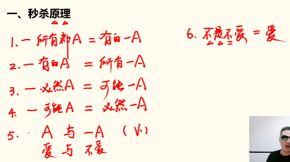

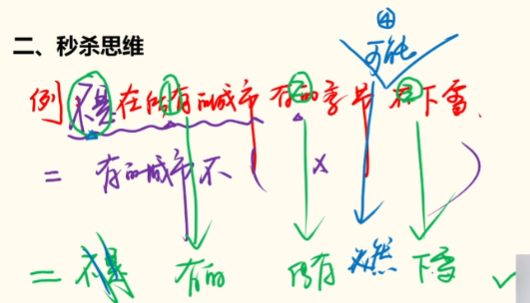

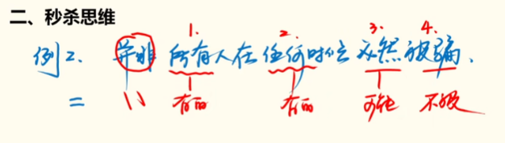

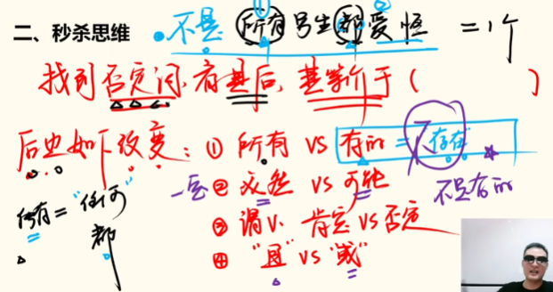
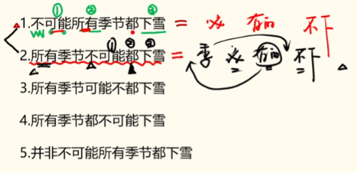

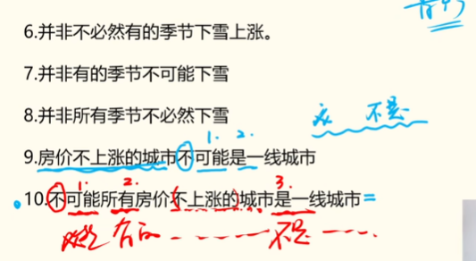


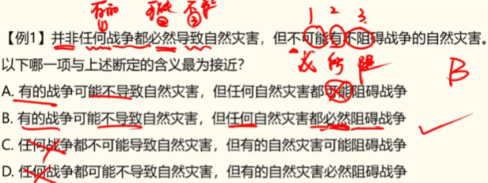

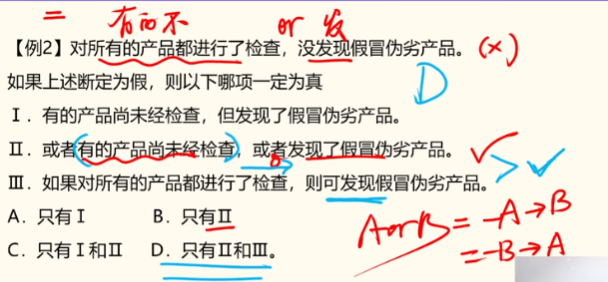
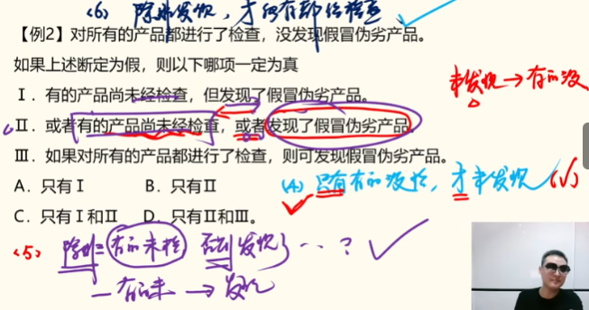

## （二）分析推理

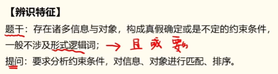
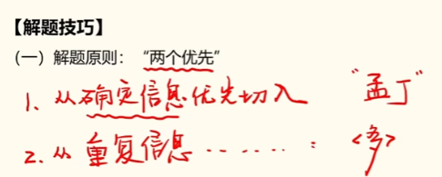
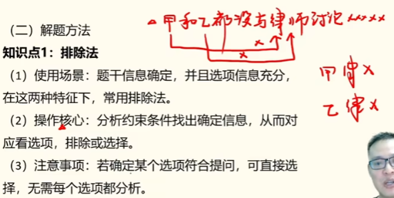

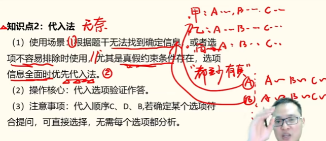
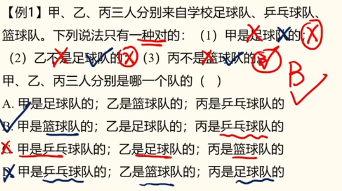
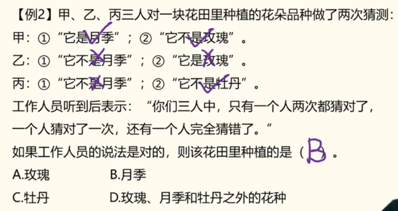

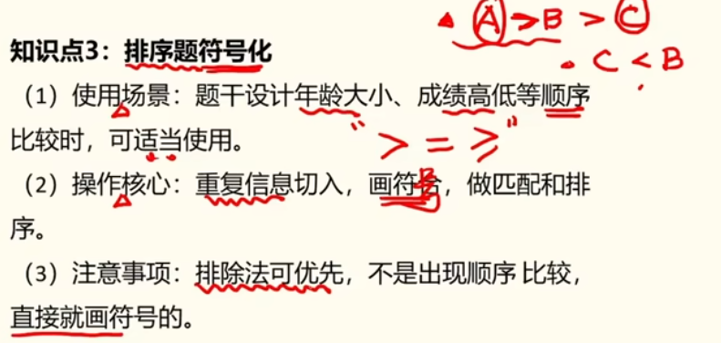
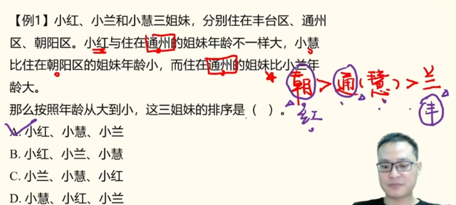


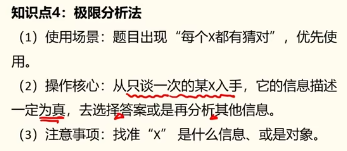
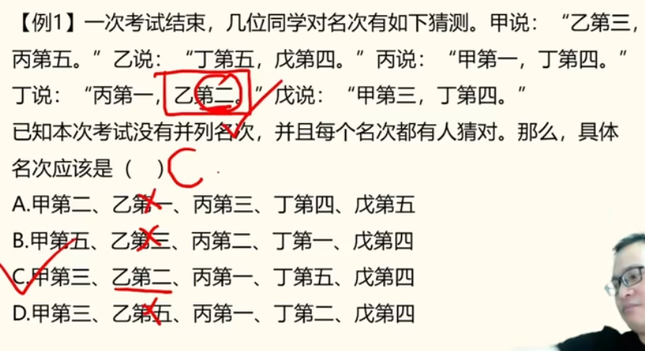
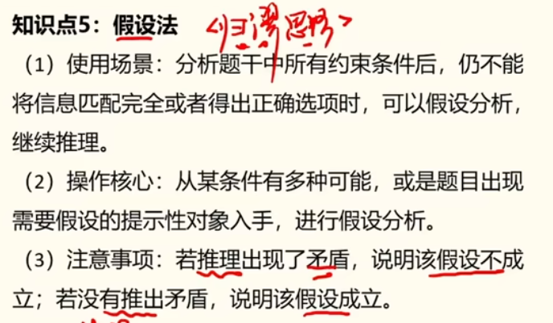


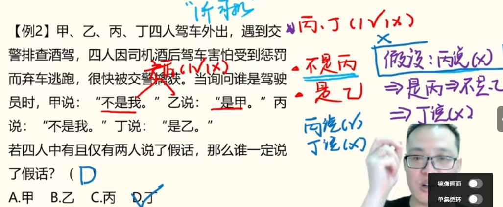

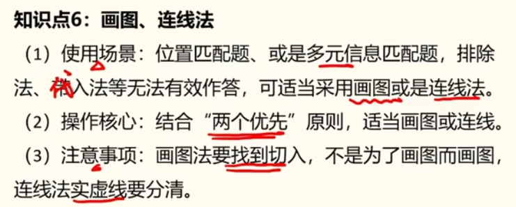


## （三）论证逻辑


